# StyleAI - AI-Powered Fashion Styling Advisor

StyleAI is an intelligent, privacy-first personal fashion styling platform powered by OpenCV, Pillow, NumPy, Flask, and Groq `llama-3.3-70b-versatile`. It accepts user-uploaded photos, detects facial skin tones, classifies them into **Fair, Medium, Olive, or Deep**, and queries Groq for structured fashion, color palette, hairstyle, and accessory recommendations with curated Indian retailer search links (Amazon India, Myntra, Zara).

---

## 🌟 Key Features

- **Automated Face & Skin Tone Detection**: Uses OpenCV Haar Cascade classifier to isolate faces and sample cheek/forehead regions.
- **Color Extraction**: Filters out shadows/highlights (`V < 45` or `V > 245`) and non-skin noise (`S < 10`), using NumPy 20th–80th percentile trimming for skin tone classification.
- **Groq LLaMA 3.3 70B Integration**: Structured JSON recommendation engine providing outfits (Formal, Business, Casual, Party), hairstyle tips, accessories, and color palettes.
- **Curated Retailer Search Links**: Dynamically generates search links for Amazon India, Myntra, and Zara based on styling queries.
- **Modern Luxury UI**: Dark mode UI (`#0F172A`) with glassmorphism, responsive cards, micro-animations, drag-and-drop upload, and progress indicators.
- **Privacy & Security**: Ephemeral upload handling in `/tmp/styleai`, EXIF metadata stripping, strict CSP security headers.
- **Production-Ready**: WSGI (Gunicorn), Docker containerized, GitHub Actions CI/CD with Cloud Run auto-deploy and automatic rollback.

---

## 🏗️ Technical Architecture

```mermaid
flowchart LR
    U[User Browser] --> F[Flask App]
    F --> V[Upload Validation]
    V --> P[Pillow Preprocess & EXIF Strip]
    P --> C[OpenCV Face Detection]
    C --> S[Skin Tone Sampler]
    S --> N[NumPy RGB Stats]
    N --> K[Skin Tone Classifier]
    K --> G[Groq LLaMA 3.3 70B]
    G --> R[Structured Recommendation JSON]
    R --> L[Shopping Link Builder]
    L --> UI[Rendered Results Page]
```



---

## 🛠️ Environment Variables

Copy `.env.example` to `.env`:

```bash
cp .env.example .env
```

| Variable | Required | Default / Example | Purpose |
|---|---|---|---|
| `FLASK_ENV` | Yes | `development` | Flask runtime mode |
| `SECRET_KEY` | Yes | `change-me-secret-key` | Session security |
| `MAX_CONTENT_LENGTH_MB` | Yes | `10` | Upload limit cap |
| `UPLOAD_TMP_DIR` | Yes | `/tmp/styleai` | Temporary directory |
| `GROQ_API_KEY` | Yes | `gsk_...` | Groq API Key |
| `GROQ_BASE_URL` | Yes | `https://api.groq.com/openai/v1` | Groq API Endpoint |
| `GROQ_MODEL` | Yes | `llama-3.3-70b-versatile` | LLaMA model |
| `APP_HOST` | Yes | `0.0.0.0` | Host bind address |
| `APP_PORT` | Yes | `8080` | Port bind address |

---

## 🚀 Quick Start (Local Development)

### 1. Install & Bootstrap Environment
```bash
bash scripts/bootstrap.sh
```

### 2. Run Local Development Server
```bash
bash scripts/dev.sh
# Server starts at http://localhost:8080
```

### 3. Run Test Suite & Code Quality Checks
```bash
bash scripts/test.sh
```

---

## 🐳 Docker & Containerization

Build and run locally with Docker Compose:

```bash
# Build production image
bash scripts/build.sh

# Run stack
docker-compose up --build -d

# Smoke test local stack
bash scripts/smoke_test.sh http://localhost:8080
```

---

## ☁️ Deployment & CI/CD Pipeline

The GitHub Actions workflows (`.github/workflows/ci.yml` and `cd.yml`) perform:
1. Linting & Unit/Integration testing (Coverage >= 85%)
2. Docker build & Artifact Registry push
3. Deploy to Google Cloud Run
4. Execute post-deploy smoke tests against public URL
5. Automatic rollback to previous Cloud Run revision if smoke test fails

### Manual Cloud Run Deploy
```bash
bash scripts/deploy_cloud_run.sh
```

### Manual Rollback
```bash
bash scripts/rollback_cloud_run.sh
```

---

## 🛡️ Production Runbook & Troubleshooting

1. **No Face Detected**: Ensure photo is clear, front-facing, and well-lit. The system will return a graceful 400 validation error if no face ROI is isolated.
2. **Groq API Timeout / Fallback**: If Groq API key is missing or invalid, the backend operates in mock mode for development. In production, check `LOG_LEVEL=INFO` logs for API HTTP status.
3. **Temp Directory Maintenance**: Files are processed in memory and `/tmp/styleai` and automatically deleted upon request completion.
